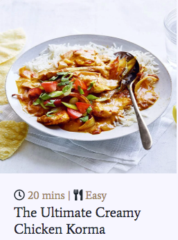
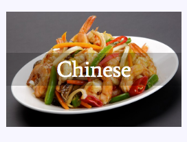
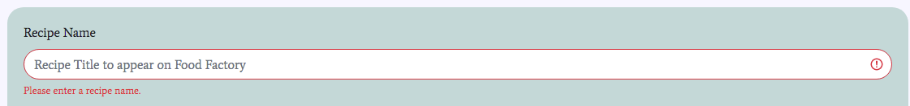
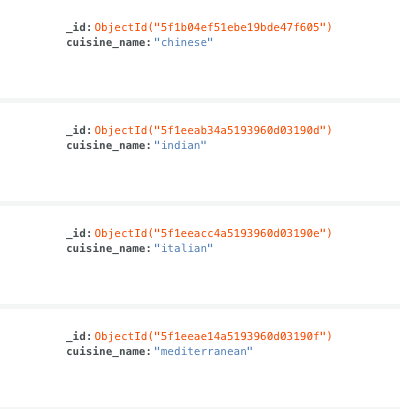
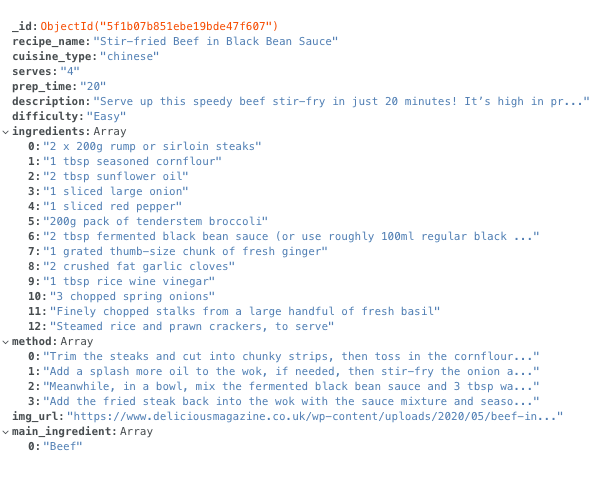

<h1 align="center">
  <a href="" target="_blank"></a>
</h1>

<h2 align="center">

<a href="" target="_blank">Food Factory</a>
</h2>

<div align="center">

**Let's Get Cooking!**

<br>

[Food Factory]() Intro about what food factory does.
</div>

## UX

### Project Goal

To create a single page site that calls upon the Google Maps & Google Places API to allow visitors to:
- 
- 
- 

#### User goals
- 

#### Business goals

- 

#### User Groups
There are 3 main user groups that have been identified:
 - 

#### User Stories

As a user visiting the site, I would like:

- 

### Design Choices

**Fonts**
- X FONT was used for headings and open sans for body text and labels. Special font "Monoton" was used for “Food Factory" for the nav logo to create a branded look.

**Icons**
- 

**Colours** 
- Muted colours were used so as to not clash with the array of colours provided by the recipe images so that the site remains readable.

**Hero Image**
- Chopping board with knife and basic ingredients signals to the user they have arrived onto a cooking website. An opaque overlay applied to soften image.

**Styling**
- All buttons have rounded corners inline with current trends.

### Wireframes

[Figma](https://www.figma.com/) was used to produce the wireframes for the desktop and mobile layouts of the site.

- [Desktop]()

## Existing Features
### Elements on All Pages 

**Navbar**
- Logo conventionally positioned top left and reloads the page
- Home - takes the user back to the home page from anywhere on the site.
- Recipes - navigates to the the recipes page displaying all recipes.
- Add recipe - takes the user to a form where they can enter details of their own recipe.
- Cuisines - dropdown menu that allows users to view recipes by cuisine type.
- The nav has class ```navbar-expand-md``` applied so the full navbar is available for tablet screen sizes upwards.
- The has also been set to ```sticky-top``` so it is always available to the user for easy navigation whatwever the scroll position of the window.

**Footer**

- Features social media icons. 
- The links have the ```target=_blank``` property to open these platforms in a new window. 
- The links point to the homepage of each platform at this time.

### Home Page

**Hero Image**
- This was selected because it perhaps reflects the postion many visitors to the site find themselves. They are ready to cook and have the basic tools and ingredients to hand but are lacking inspiration.

**Get Inspired Section**
- takes a sample of 4 recipes from the database when the page loads using ```aggregate``. This provides a snapshot of the range of recipes and hopefully provide, as the name suggests some inspiration for the user. 
- For each recipe, an image of the recipe is displayed with the prep time, skill indicator and recipe name underneath.
<div align="center">

</div>

- The recipe name is clickable and takes the user to a view showing ```recipe detail``` for that particular recipe.
- An **All Recipes** button is made conveniently available for the user that is now sufficiently enticed by the sample recipe pictures. Clicking the button takes them to the **recipes** page.

**Search by Cuisine Section**
- This section displays the (currently) 4 different cuisine types featured on the site.
- Clicking a cuisine type image takes the user to the recipes page, filtered by that cuisine type.

<div align="center">

</div>

### Recipes Page
- HOW MANY COLUMNS BY SCREENSIZE?
- CARD IS AS PER LAYOUT FROM HOMEPAGE?
- BUTTONS AVAILABLE TO FILTER BY MAIN INGREDIENT
- TITLE CHANGES DEPENDING ON NAV METHOD. IF ALL RECIPES THEN "ALL RECIPES". If by cuisine type, then Chinese etc.
- There is a count displayed of the recipes fouund for the users selection.
- When selecting main ingredient, the ```active``` button is highlighted. This currently doesnt work as the page reloads.

### Add Recipe Page
- Each field has a label and placeholder to guide the user.
- All fields have the ```required``` attribute and ```html validation```.
- **Bootstrap's Custom** form validation, which utilisies the ```novalidate``` attribute is also used which highlights to user which fields are invalid.

<div align="center">

</div>

- On loading the page, the user is presented just **one** field for both **Ingredients** and **Preparation Steps**. After they have used the initial field they can add another by clicking the "+" button underneath the initial field. there is also a "-" button in case they create too many fields and end up not using them.
- **Image** upload can only be by link at this time. Due to **MongoDB** being an ephemeral system, images cannot be stored.
- By clicking the **Upload Recipe** button, the details the user entered are uploaded to the database and the user is redirected back to the recipes page where they will be receive a confirmation message advising that the recipe they entered was added. If they scroll down the recipe will be at the bottom of the page.
- If the user changes their mind whilst mid-way through filling out they form they can click the **CANCEL** button and them will again be rediredcted back to the **Recipes page**

### Pages with Indirect Navigation

### Recipe Detail Page


### Edit Recipe Page
- 

### Custom 404 Page


## Features Left to Implement
**View More button/pagination**
- To load more results not contained in viewport. Tried this with ```limit``` but couldnt get it to work.

**Shopping list**
- Build a shopping list from the recipe(s) ingredients list with ability to delete out ingredients already in the store cupboard.

**User login** 
- Although authentication was not a requirement for this project, a login area would be a nice feature , otherwise a user could anonymously delete all the contents of the database. The ability to add/edit/delete recipes could be made functionality only avilable when logged in.

**Text Search Field**

- Provide a search box for users to key in an ingredient to search recipes which contain that ingredient. It is currently possible to filter recipes by ```main_ingredient``` but this relies on this field being accurately inputed and/or maintained.

## Database Structure
- [MongoDB](https://www.mongodb.com) was chosen as the database for this project.
- There are 2 collections in the database:
    - **Cuisine_type** which currently has 4 documents. With a view to the future, more cuisine types could be added as more and more users contribute recipes.
    
    <div align="center">
        
    </div>
    
    - **Recipes** which houses a document for each individual recipe. An example document is below.

    <div align="center">
        
    </div>

## Technologies Used


- This project was built with HTML, CSS, JavaScript & Python programming languages.
- [jQuery](https://jquery.com/)
    - Used for responsive navbar and DOM manipulation
- [Popper.js](https://popper.js.org/)
    - Also used for the responsive, collapsible navbar.
- [Gitpod](https://www.gitpod.io/)
    - The developer chose this IDE to compile all code for this project.
- [GitHub](https://github.com/)
    - Used for version control.
- [Bootstrap](https://getbootstrap.com/)
    - This was used to provide a structured layout and ease of making the site responsive.
- [Google Fonts](https://fonts.google.com)
    - Text elements were styled using **Google fonts**.
- [Fontawesome](https://fontawesome.com/)
    - The source for all iconography.
- [PyMongo](https://api.mongodb.com/python/current/) for communication between Python and MongoDB.
- [Flask](https://flask.palletsprojects.com/en/1.0.x/) for routing and rendering pages.
- [Jinja](http://jinja.pocoo.org/docs/2.10/) templating logic to construct html.
- [MongoDB](https://www.mongodb.com/cloud/atlas) was used for data storage.


    
    
    

    
    