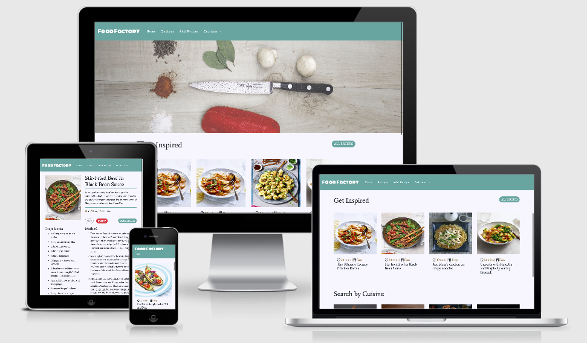

# Food Factory - Online Cookbook 

<div align="center">

</div>

At [Food Factory](https://foodfactoryrecipes.herokuapp.com/) we celebrate Eur-asian cuisine and feature mouthwatering recipes for you to try out at home. We have recipes from World renowned chefs using easily available ingredients.

## UX

### Project Goal

To create an online cookbook to allow visitors to the site to:
- Browse recipes
- Filter recipes
- Add/edit recipes
- Delete recipes

#### User goals
- To discover and try out new recipes
- Share their own recipes

#### Business goals
- Grow the recipe library by capturing user uploaded records from the database.
- Future advertising of cookware ranges.

#### User Stories

As a user visiting the site, I would like:
- to be inspired to cook by the range of recipes.
- be presented with deatils of prepartion time, skill level and serving size for each recipe.
- be able to search recipes by cuisine type.
- browse all recipes on a single page.
- filter recipes by main ingredient.
- upload my own recipes to the website
- edit and even delete recipes.

### Design Choices

**Fonts**
- ```Average``` font was used for all headings and body text. Special font ```Monoton``` was used for “Food Factory" for the nav logo to create a branded look.

**Icons**
- Clean Icons were used for the recipe **metrics** (serving size, prep time, skill level)

**Colours** 
- Muted colours were used so as to not clash with the array of colours provided by the recipe images so that the site remains readable.

**Hero Image**
- Chopping board with knife and basic ingredients signals to the user they have arrived onto a cooking website. An opaque overlay applied to soften image.

**Styling**
- All buttons have rounded corners inline with current trends.

### Wireframes

[Figma](https://www.figma.com/) was used to produce the wireframes for the desktop and mobile layouts of the site.

- [Desktop](static/img/wireframes/desktop.jpg)
- [Mobile](static/img/wireframes/mobile.jpg)

## Existing Features
### Elements on All Pages 

**Navbar**
- Logo conventionally positioned top left and reloads the page
- Home - takes the user back to the home page from anywhere on the site.
- Recipes - navigates to the the recipes page displaying all recipes.
- Add recipe - takes the user to a form where they can enter details of their own recipe.
- Cuisines - dropdown menu that allows users to view recipes by cuisine type.
- The nav has class ```navbar-expand-md``` applied so the full navbar is available for tablet screen sizes upwards.
- The has also been set to ```sticky-top``` so it is always available to the user for easy navigation whatwever the scroll position of the window.

**Footer**

- Features social media icons. 
- The links have the ```target=_blank``` property to open these platforms in a new window. 
- The links point to the homepage of each platform at this time.

### Home Page

**Hero Image**
- This was selected because it perhaps reflects the postion many visitors to the site find themselves. They are ready to cook and have the basic tools and ingredients to hand but are lacking inspiration.

**Get Inspired Section**
- takes a sample of 4 recipes from the database when the page loads using ```aggregate``. This provides a snapshot of the range of recipes and hopefully provide, as the name suggests some inspiration for the user. 
- For each recipe, an image of the recipe is displayed with the prep time, skill indicator and recipe name underneath.
<div align="center">

</div>

- The recipe name is clickable and takes the user to a view showing ```recipe detail``` for that particular recipe.
- An **All Recipes** button is made conveniently available for the user that is now sufficiently enticed by the sample recipe pictures. Clicking the button takes them to the **recipes** page.

**Search by Cuisine Section**
- This section displays the (currently) 4 different cuisine types featured on the site.
- Clicking a cuisine type image takes the user to the recipes page, filtered by that cuisine type.

<div align="center">

</div>

### Recipes Page
- Recipe ```cards``` appear 4 columns wide on ```lg``` screens upwards, 2 columns wide on ```md``` screens and stacked on top of each other on ```mobile```.
- Buttons are available above to **filter** by 4 key main ingredients.
- The **sub-title** changes to reflect which button was clicked, and the number of recipes are displayed for the user's selection.
- The filtered **cuisine type view** of this page displays cuisine type **buttons** instead and the page **title changes** to match which button was clicked.

### Add Recipe Page
- Each field has a label and placeholder to guide the user.
- All fields have the ```required``` attribute and ```html validation```.
- **Bootstrap's Custom** form validation, which utilisies the ```novalidate``` attribute is also used which highlights to user which fields are invalid.

<div align="center">

</div>

- On loading the page, the user is presented just **one** field for both **Ingredients** and **Preparation Steps**. After they have used the initial field they can add another by clicking the "+" button underneath the initial field. there is also a "-" button in case they create too many fields and end up not using them.
- **Image** upload can only be by link at this time. Due to **MongoDB** being an ephemeral system, images cannot be stored.
- By clicking the **Upload Recipe** button, the details the user entered are uploaded to the database and the user is redirected back to the recipes page where they will be receive a confirmation message advising that the recipe they entered was added. If they scroll down the recipe will be at the bottom of the page.
- If the user changes their mind whilst mid-way through filling out they form they can click the **CANCEL** button and them will again be redirected back to the **Recipes page**

### Pages with Indirect Navigation

### Recipe Detail Page
- clicking a **recipe card** takes the user to the **detailed** recipe page for that dish with a full list of ingredients and preparation steps.
- There are also buttons to ```edit``` and ```delete``` the recipe.
- In future, users will **only** be able to delete recipes they have uploaded.

### Edit Recipe Page
- This is accessed when the user clicks the **edit** button on the **Recipe Details Page**
- Here, the user is presented with the same form used to **add** a recipe, **pre-populated** with the current details in the database for that recipe.
- Again, moving forward users will only be able to edit **their** own uploads.

## Features Left to Implement
**Load More button/pagination** 
- To render data in batches to load more results not contained in viewport. Tried this with ```limit``` but could not get it to work.
**Custom 404 page** 
- To provide nav options for the user when a 404 error occurs.

**Flash messages in Flask**
- To give  confirmation feedback to the user when they have carried out **add/edit/delete** operations.

**Shopping list**
- Build a shopping list from the recipe(s) ingredients list with ability to delete out ingredients already in the store cupboard.

**User login** 
- Although authentication was not a requirement for this project, a login area would be a nice feature , otherwise a user could anonymously delete all the contents of the database. The ability to add/edit/delete recipes could be made functionality only available when logged in and also restricted to those records initially added by that user.

**Text Search Field**

- Provide a search box for users to key in an ingredient to search recipes which contain that ingredient. It is currently possible to filter recipes by ```main_ingredient``` but this relies on this field being accurately inputed and/or maintained.

## Database Structure
- [MongoDB](https://www.mongodb.com) was chosen as the database for this project.
- There are 2 collections in the database:
    - **Cuisine_type** which currently has 4 documents. With a view to the future, more cuisine types could be added as more and more users contribute recipes.
    
    <div align="center">
        
    </div>
    
    - **Recipes** which houses a document for each individual recipe. An example document is below.

    <div align="center">
        
    </div>

## Technologies Used


- This project was built with HTML, CSS, JavaScript & Python programming languages.
- [jQuery](https://jquery.com/)
    - Used for responsive navbar and DOM manipulation
- [Popper.js](https://popper.js.org/)
    - Also used for the responsive, collapsible navbar.
- [Gitpod](https://www.gitpod.io/)
    - The developer chose this IDE to compile all code for this project.
- [GitHub](https://github.com/)
    - Used for version control.
- [Bootstrap](https://getbootstrap.com/)
    - This was used to provide a structured layout and ease of making the site responsive.
- [Google Fonts](https://fonts.google.com)
    - Text elements were styled using **Google fonts**.
- [Fontawesome](https://fontawesome.com/)
    - The source for all iconography.
- [PyMongo](https://api.mongodb.com/python/current/) for communication between Python and MongoDB.
- [Flask](https://flask.palletsprojects.com/en/1.0.x/) for routing and rendering pages.
- [Jinja](http://jinja.pocoo.org/docs/2.10/) templating logic to construct html.
- [MongoDB](https://www.mongodb.com/cloud/atlas) was used for data storage.

# Testing 

### Code Validation

Validation tools were used to check that the website code was valid:

- [W3C Mark Up Validation](https://validator.w3.org) for HTML.
    - Passed test with no warnings.
- [W3C CSS Validation](https://jigsaw.w3.org/css-validator/) for CSS.
    - Passed all tests with no issues.
- [JSHint](https://jshint.com/) for JavaScript.
    - One warning regarding an unused variable ```validation```. My feeling is that this is an empty array until the form **submit** button is clicked and the script then checks for forms with the ```needs-validation``` class.
- [PEP8](http://pep8online.com/) for Python
    - 3 ```line too long``` issues and 1 ```trailing whitespace```. 

### User Stories Testing

**To be inspired to cook by the range of recipes**
- Browse the **Get inspired** section which serves up 4 sample recipe images
- There are 4 cuisine types featured and each recipe has easy to follow instructions.

**Be presented with details of prepartion time, skill level and serving size for each recipe**
- Icons under the image on the recipe cards provide **cooking time** and **skill level** and an additional **serving size** icon is provided on the recipe details page.

**Be able to search recipes by cuisine type**
- There is a **cuisines** dropdown in the navbar and when a selection is made it takes the user to the recipes view, filtered by that cuisine type.
- The user can then switch between cuisine types with the **buttons** above the recipe cards.

**Browse all recipes on a single page**
- This view can be accessed by clicking **Recipes** in the navbar or by selecting **All Cuisines** in the Cuisines dropdown, or clicking the **All Recipes** button when it is available.

**Filter recipes by main ingredient**
- In the **All Recipes** view there are 4 main ingredient buttons which when clicked filter the recipes by that ingredient.

**Upload my own recipes to the website**
- Click **Add Recipe** in the nav which takes the user to a form to fill in the recipe details.

**Edit and even delete recipes**
- Having navigated to the single recipe details page there are 2 buttons, **edit** and **delete**. 
- Clicking **Edit** allows the user to edit the details in the already populated **add recipe** form. Clicking update returns the user to the recipe details page for that recipe.
- Clicking **delete** naturally deletes the recipe and returns the user to the **all recipes** view.

### Manual Functionality Testing

**Browsers**

The site was tested on the following browsers: Chrome, Firefox, Safari, Internet Explorer & Edge on desktop and laptop devices.

**Mobile Devices**

- The devices used for testing were:
    - iPhone 6s, XR
    - iPad Air 
    - Samsung S10

**Navigation**

- On desktop, go to the landing page.
- Reduce the browser size down to mobile to verify that the navbar is responsive and switches from the expanded, inline menu to burger menu at this screen size.
- Click on the **Food Factory** logo in the top left of the navbar and confirm that it links to the home page **(page will reload when clicked)**.
- Click on each navigation menu element and confirm that it links to the correct section.
- Confirm that there is a colour change when hovering over the navbar links.
- Reduce the screen down to small and confirm the burger menu drops down when clicked.
- Check that the navbar becomes sticky when the window is scrolled down.
- All above functionality and checks carried out on tablet and mobile.

**Hero Image and Text**

- Check all screen sizes and confirm that the background image looks good.

# Deployment

## How to run this project locally

Here are instructions to run this project within your chosen IDE:

Pre-requisites:
- [Git](https://gist.github.com/derhuerst/1b15ff4652a867391f03)
- [PIP](https://pip.pypa.io/en/stable/installing/)
- [Python 3](https://www.python.org/downloads/)
- An account at [MongoDB Atlas](https://www.mongodb.com/cloud/atlas). 
    - How to set up your Mongo Atlas account [here](https://docs.atlas.mongodb.com/).

### Instructions

1. Follow this link to the [Food Factory repository](https://github.com/jpg6453/food-factory/). 
2.	Click the green **Code** button.
3.	A Clone with HTTPs modal appears on screen, copy the clone URL for the repository.
4.	Within your chosen IDE launch a terminal session
5.	Ensure the current working directory is the location where you want the cloned directory to be made. Change this if necessary.
6.	Type ```git clone```, and then paste the URL copied in Step 3.
```
git clone https://github.com/jpg6453/food-factory
```

7.	Press **Enter** and a clone will be created locally. This could take a few minutes.

8. In terminal, install all required modules with the command 
```
pip -r requirements.txt.
```
9. Create an environment variable and set this to the value of your MONGO_URI. How to do this will vary by IDE and individual set-up.
10. You can now run the application with the command
```
python app.py
```

9. You can visit the website at `http://127.0.0.1:5000`

## Heroku Deployment

To deploy the project to heroku:

1. Create a `requirements.txt` file using the terminal command `pip freeze > requirements.txt`.

2. Create a `Procfile` with the terminal command `echo web: python app.py > Procfile`.

3. `git add`, `git commit` the requirements and Procfile and then `git push` the changes to GitHub.

3. Create a new app on the [Heroku website](https://dashboard.heroku.com/apps) by clicking the "New" button in your dashboard. Give it a name and set the region to Europe.

4. From the heroku dashboard of your newly created application, click on "Deploy" > "Deployment method" and select GitHub.

5. Confirm the linking of the heroku app to the correct GitHub repository.

6. In the heroku dashboard for the application, click on "Settings" > "Reveal Config Vars".

7. Set the following config vars:

| Key | Value |
 --- | ---
DEBUG | FALSE
IP | 0.0.0.0
PORT | 5000
MONGO_URI | `mongodb+srv://<username>:<password>@<cluster_name>-qtxun.mongodb.net/<database_name>?retryWrites=true&w=majority`

- To get your own MONGO_URI check out the MongoDB documentation [here](https://docs.atlas.mongodb.com/)

8. In the heroku dashboard, click "Deploy".

9. In the "Manual Deployment" section of this page, made sure the master branch is selected and then click "Deploy Branch".

10. The site is now successfully deployed.

## Credits


**Images**

- Hero & Cuisine type images [Pixabay](https://pixabay.com/)

- Recipe Images and details [Delicious Magazine](https://www.deliciousmagazine.co.uk/)

**Code**

- Floating to top button – [W3Schools](https://www.w3schools.com/howto/howto_js_scroll_to_top.asp)
- Functions to add and remove form input fields - Adapted from this tutorial from [codexworld](https://www.codexworld.com/add-remove-input-fields-dynamically-using-jquery/*/)
- Bootstrap custom form validation, taken from the [documentation](https://getbootstrap.com/docs/4.0/components/forms/#how-it-works)     

## Acknowledgements

A big thank you to my Code Institute Mentor, Maranatha Ilesanmi, for demonstrating concepts and providing focus when time was tight!

## Disclaimers

- This project was developed for educational purposes and all images are licence free.
- In the interests of speed loading recipes to the database, ingredients and method steps may not match the recipe image.


    
    
    

    
    
